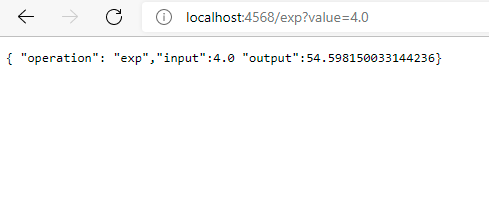

# Parcial AREP Corte 2
# Julian Adolfo Peña Marin

### Operaciones Asignadas
* Logaritmo Natural ln(x)
* Exp(el numero de euler elevado a la potencia dem parametro) exp(x)

### Evidencias desde el localhost

* Corriendo Proxy
  
  
  
* Corriendo Servicios Calculadora
  
  
  
* Funcion Logaritmo Natural
  
  
  
* Funcion Logaritmo Natural
  
  

* Creacion Instancias

  

### Instrucciones para el despliegue y evidencia del funcionamiento
1. Primero se accede a la maquina por medio de ssh, utilizando la llave privada que esta subida en el repositorio
2. Una vez ingresado, se debe instalar en las tres maquinas java y git, con los siguientes comandos:
  ```sudo yum install git ```
  ```sudo yum install java-1.8.0```
  
3. Una vez instalado accedemos a la siguiente ruta ```/home/ec2-user/``` para clonar el repositorio con el siguiente
   comando ```git clone "url repositorio"```, en este caso es https://github.com/JulianP-24/arep-parcial2.git
   
4. Una vez clonado accedemos en una maquina al proxy y lo corremos, en las otras dos maquinas corremos los servicios con 
   el siguiente comando:
   
   Para correr el proxy
   ```java -cp "target/classes:target/dependency/*" edu.escuelaing.arep.proxy.App```
   
   
   
   Para correr los servicios de la calculadora
   ```java -cp "target/classes:target/dependency/*" edu.escuelaing.arep.sparkApp```
   
   
   
   

5. En cada maquina se habilita el puerto 4567 en una regla de entrada, para que se pueda acceder a los servicios
	
   

6. Una vez habilitados los puertos y corriendo las tres maquinas ec2, accedemos a las maquinas virtuales, en donde
   se corren los servicios, las cuales son las siguientes:
   
	* http://ec2-34-203-225-83.compute-1.amazonaws.com:4567/ln?value=8.0
	
	  Donde se le indica la funcion que quiere realizar y el valor
	  
	  
	  
	* http://ec2-54-84-139-108.compute-1.amazonaws.com:4567/exp?value=5.0
	  
	  Donde se le indica la funcion que quiere realizar y el valor
	  
	  
    

7. Link del video: https://pruebacorreoescuelaingeduco.sharepoint.com/:v:/s/videospti/EZg0BoduwT5PpCtXzVScTBsBkYTvqqIDFlxBEBbCuYNMbg?email=luis.benavides%40escuelaing.edu.co&e=NGswa9
